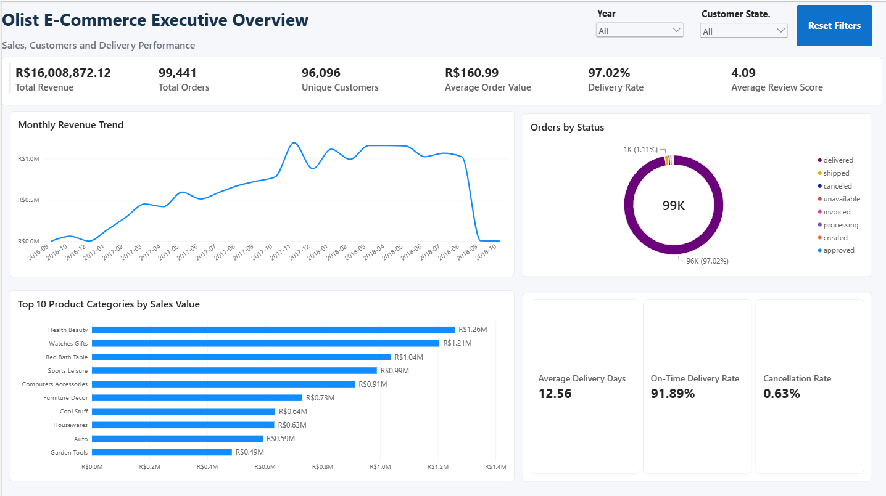
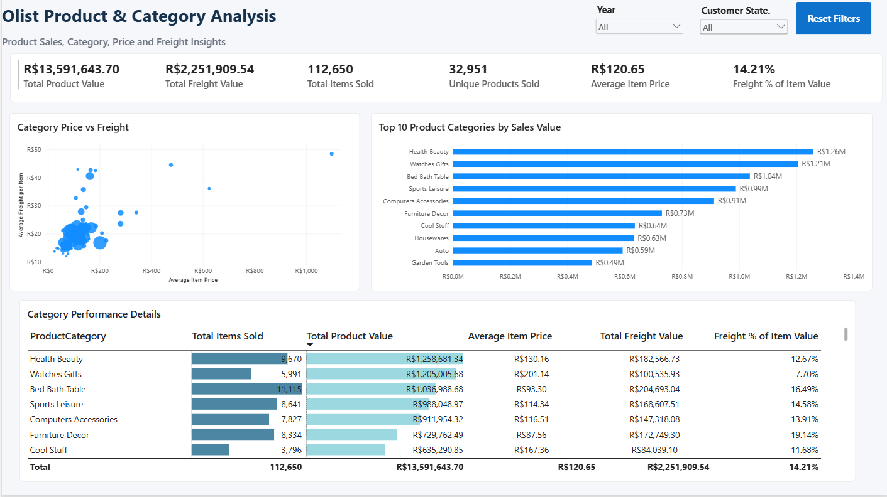
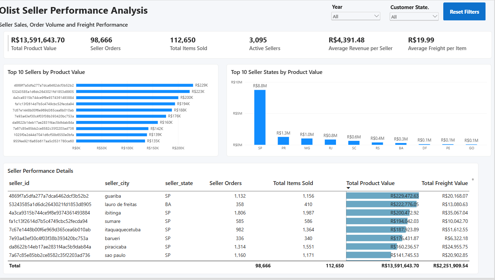
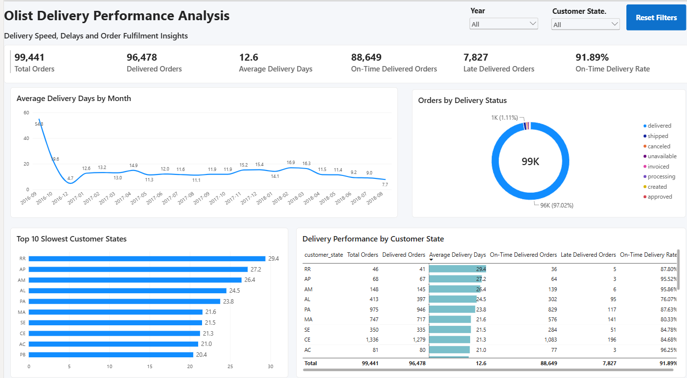
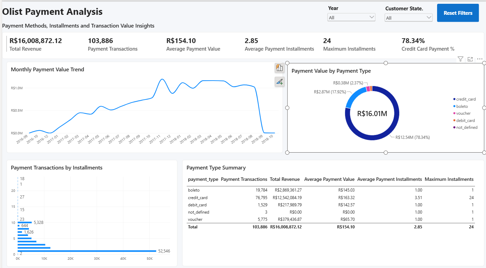
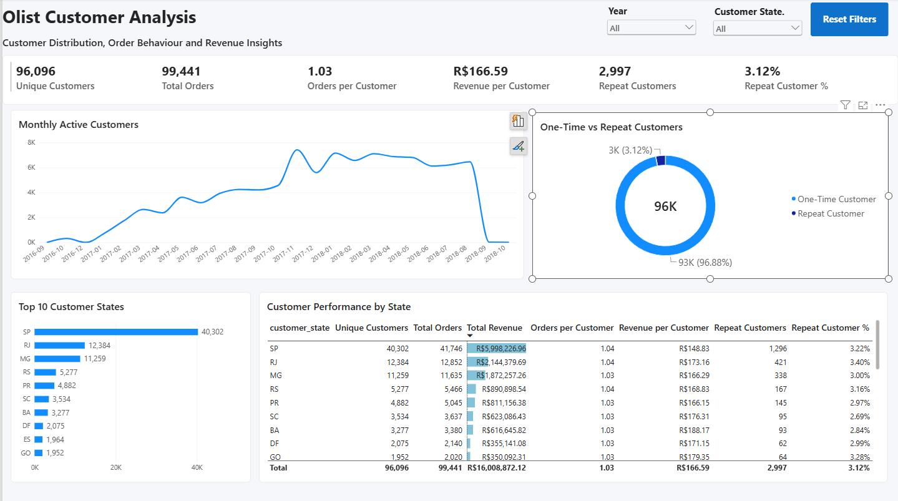
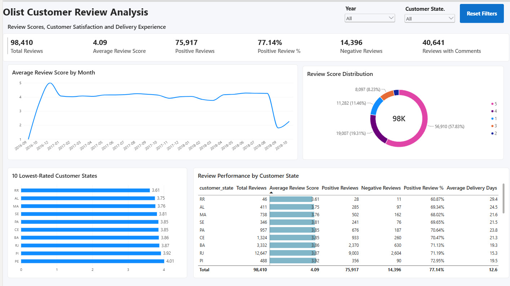
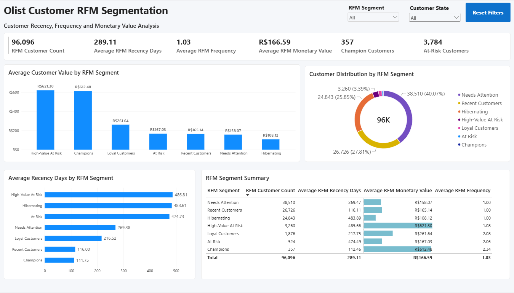
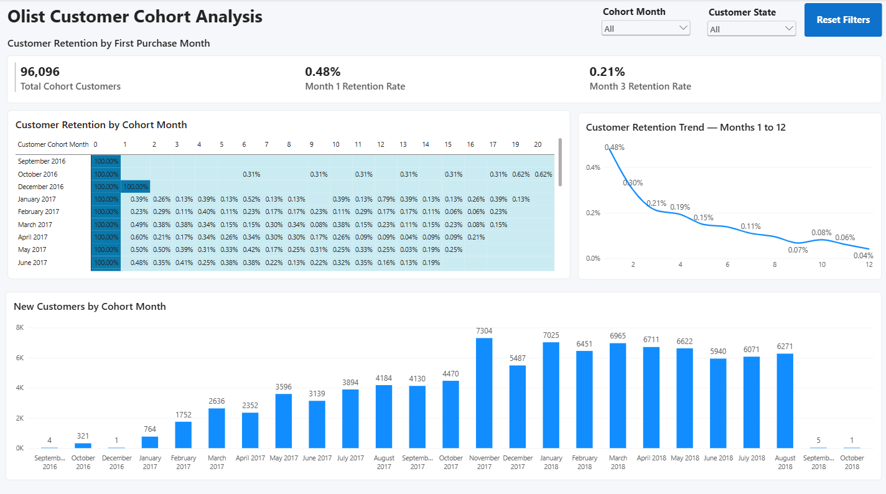
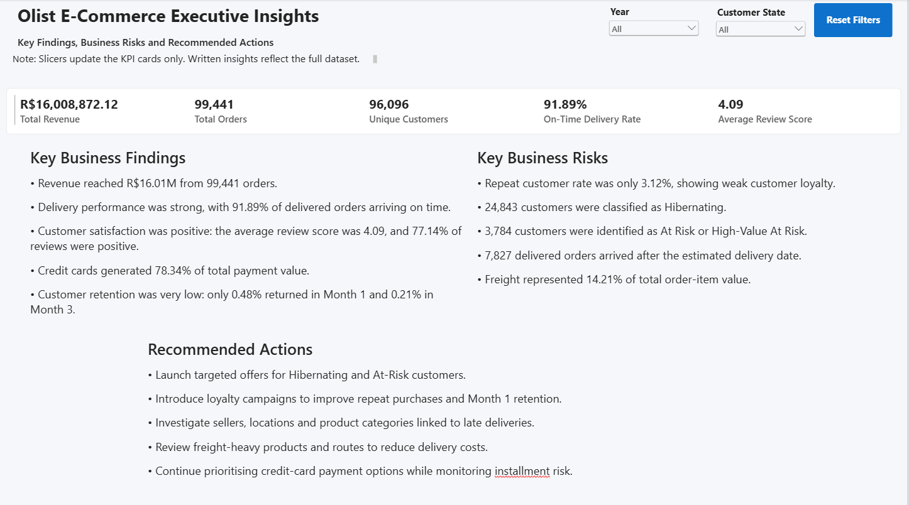

# Olist E-commerce Analytics

## Project Overview

This project presents an end-to-end analysis of the Brazilian Olist e-commerce dataset to understand revenue performance, order trends, product categories, seller performance, delivery operations, payment behaviour, customer activity, reviews, RFM segmentation and customer retention.

## Analytics Workflow

Power Query ETL & Data Cleaning → Power BI Data Model → DAX Measures → Interactive Dashboards → Business Insights

**Dataset:** Brazilian E-commerce Public Dataset by Olist

## Dataset Overview

- Orders: 99,441 rows
- Order items: 112,650 rows
- Reviews: 100,000 rows
- Sellers: 3,095 rows
- Source files: 9 CSV files

## Business Objective

The analysis was designed to answer key business questions:

- What is the overall revenue and order performance?
- How do revenue and orders change over time?
- Which product categories generate the highest revenue?
- Which sellers contribute the most revenue?
- What is the average delivery time?
- How many orders were delivered late?
- Which payment methods are used most frequently?
- How commonly do customers use payment instalments?
- How many customers made repeat purchases?
- How can customers be grouped using RFM segmentation?
- How does customer retention change across monthly cohorts?
- What operational improvements can be recommended?

## Tools & Technologies

| Tool | Usage |
|---|---|
| Power Query | Data profiling, cleaning, transformation and ETL |
| Power BI | Data modelling, DAX measures, KPI reporting and dashboards |
| DAX | Business measures, time intelligence, RFM and customer analysis |
| Excel | Data profiling log and validation documentation |
| GitHub | Project documentation and portfolio presentation |

## End-to-End Analytics Workflow

### 1. Power Query ETL & Data Preparation

Power Query was used to:

- Import and profile nine CSV files
- Clean and standardize text fields
- Validate date and timestamp columns
- Check missing and invalid values
- Create date-only fields for analysis
- Prepare fact and dimension tables
- Disable loading for staging queries
- Validate row counts before loading the model

### 2. Power BI Data Model

A star-schema-style model was created using:

- `FactOrders`
- `FactOrderItems`
- `FactPayments`
- `DimCustomer`
- `DimSeller`
- `DimProduct`
- `DimDate`
- `DimGeography`
- `CustomerRFM`

Relationships were created to support order, customer, product, seller, payment, delivery, geographical and time-intelligence analysis.

### 3. DAX Measures

DAX measures were developed for:

- Total Revenue
- Total Orders
- Total Items Sold
- Unique Customers
- Average Order Value
- Average Delivery Days
- Late Delivery Count
- Cancelled Orders
- Average Payment Instalments
- Repeat Customers
- Revenue MoM, QoQ and YoY
- RFM Customer Count

### 4. Power BI Dashboard

Ten dashboard pages were developed:

1. Executive Overview
2. Product Analysis
3. Seller Performance
4. Delivery Analysis
5. Payment Analysis
6. Customer Analysis
7. Review Analysis
8. Customer RFM Segmentation
9. Customer Cohort Analysis
10. Executive Insights

## Key Analysis Areas

### Revenue & Orders

- Revenue and order performance were analysed across time.
- Month-over-month, quarter-over-quarter and year-over-year measures were created.
- Average order value was included to assess customer spending.

### Product & Seller Performance

- Product categories were compared using revenue and sales volume.
- Top sellers were identified based on revenue contribution.
- Seller performance was analysed across locations and product categories.

### Delivery Performance

- Average delivery duration was measured.
- Late and cancelled orders were monitored.
- Delivery performance was compared across locations and periods.

### Payments

- Payment-method usage was analysed.
- Instalment behaviour was examined.
- Payment records were validated using payment sequence information.

### Customer Analysis

- Unique and repeat customers were measured.
- Customer purchasing behaviour was analysed.
- RFM segmentation was used to group customers by recency, frequency and monetary value.

### Cohort Analysis

- Customers were grouped by their first-purchase month.
- Monthly order activity was compared across cohorts.
- The analysis was used to understand customer retention over time.

## Power BI Dashboard

### Executive Overview



### Product Analysis



### Seller Performance



### Delivery Analysis



### Payment Analysis



### Customer Analysis



### Review Analysis



### Customer RFM Segmentation



### Customer Cohort Analysis



### Executive Insights



## Business Recommendations

- Monitor revenue and order trends regularly using time-intelligence KPIs.
- Focus marketing and inventory planning on high-performing product categories.
- Work with underperforming sellers to improve fulfilment and delivery performance.
- Investigate the causes of late deliveries across locations and sellers.
- Use customer review results to identify service-quality issues.
- Develop targeted campaigns for valuable RFM customer segments.
- Create re-engagement strategies for inactive customers.
- Monitor cohort retention to evaluate long-term customer engagement.
- Review payment and instalment behaviour when planning promotions.
- Continue validating operational KPIs during each data refresh.

## Repository Structure

```text
Olist-Ecommerce-Analytics/
│
├── Olist_Ecommerce_Analytics.pbix
├── Olist_Ecommerce_Analytics_Project_Documentation_Final.docx
├── Olist_Data_Profiling_Log.xlsx
├── 01_Executive_Overview.png
├── 02_Product_Analysis.png
├── 03_Seller_Performance.png
├── 04_Delivery_Analysis.png
├── 05_Payment_Analysis.png
├── 06_Customer_Analysis.png
├── 07_Review_Analysis.png
├── 08_Customer_RFM_Segmentation.png
├── 09_Customer_Cohort_Analysis.png
├── 10_Executive_Insights.png
├── Validation_Checks.png
└── README.md
